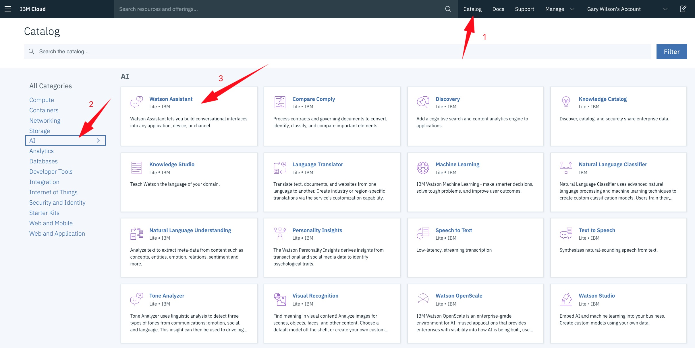
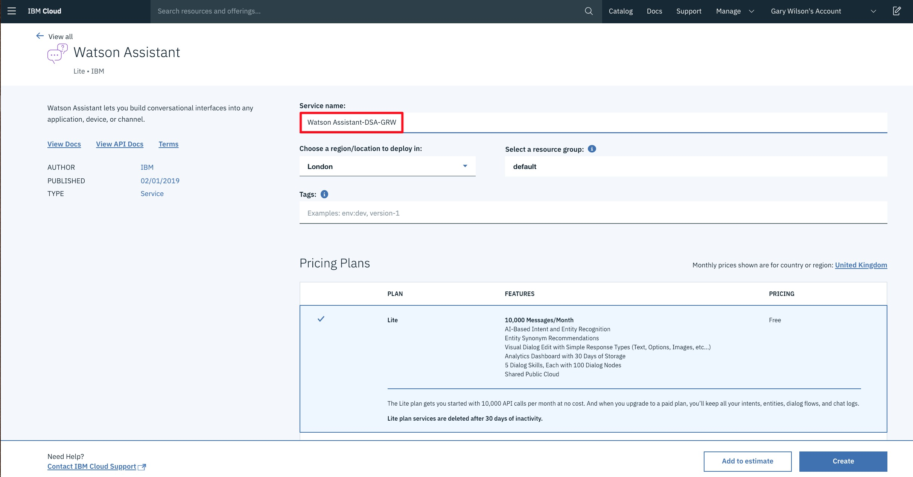
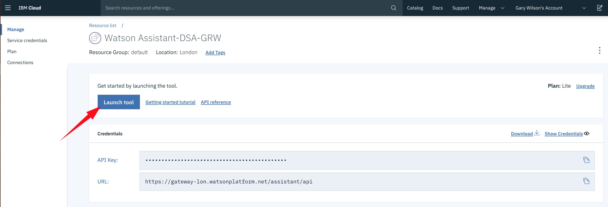
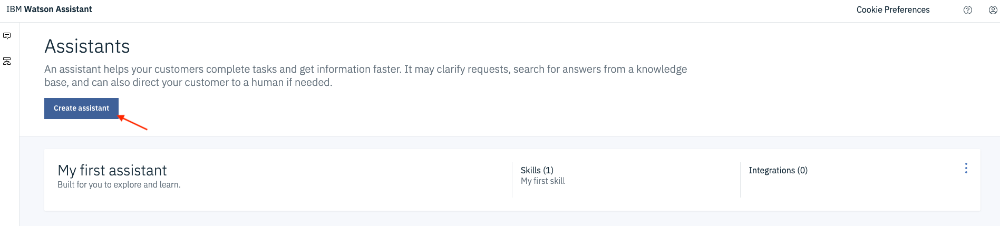
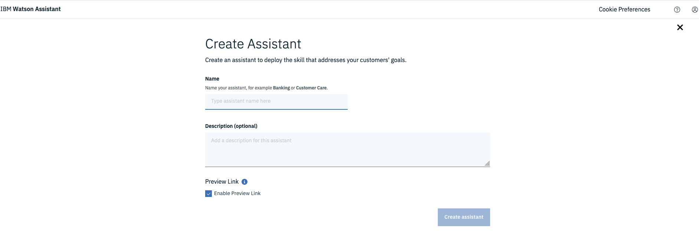

# _**Watson Assistant 101**_: Lab 1 - Build A Chatbot
In this lab we'll start to build a chatbot using _**Watson Assistant**_. This basic chatbot will recommend a new mobile phone for a user based on their feedback about previous experiences they've had with phones.

## Requirements
- [IBM Cloud account](https://ibm.biz/Bd2NYZ)

## Agenda
- Introduction to [Watson Assistant](https://www.ibm.com/cloud/watson-assistant/)
- Setup the **_Watson Assistant_** service
- Understanding user intent: create **_intents_** and _**entities**_
- Building chatbot responses: create a _**dialog tree**_
- Test your chatbot!

## Introduction to Watson Assistant
IBM **_Watson Assistant_** allows you to create cognitive chatbots that you can customise for your business, and deploy them across multiple channels to bring help to your customers where and when they need it.

Most chatbots try to mimic human interactions, which can frustrate users when a misunderstanding arises. Watson Assistant is more. It knows when to search for an answer from a knowledge base, when to ask for clarity, and when to direct you to a human.

Anyone can build chatbots with **_Watson Assistant_** - it comes pre-trained with industry-relevant content, can make sense of your historical chat or call logs, and has a visual dialog editor. Industry-leading AI powers the underlying natural language models that understand your users and provides training recommendations as you build and run your chatbot. And you have the flexibility to deploy **_Watson Assistant_** within your own site, in a mobile app, and via many messaging channels and customer service tools.

## Setup the Watson Assistant service
In this section we are going to create a **_Watson Assistant_** instance on IBM Cloud, and use it to build a basic chatbot that answers queries about mobile phones.

**(1)** Log into IBM Cloud and create a **_Watson Assistant_** service.
- Click on `Catalog`, then filter by clicking on `AI`
- Select `Watson Assistant`

**(2)** Create the service with a unique name: we'd suggest something like `Watson Assistant-eventname-yourinitials`, e.g. `Watson Assistant-DSA-GRW`.

A significant number of _**IBM Cloud**_'s capabilities work using a freemium-type model called a `Lite` plan. This means that you can experiment with cloud and AI services - including building live applications such as the chatbot we'll create here - at no cost.

Scroll down and ensure you are using the `Lite` plan, then hit `Create`.

**(3)** Launch the **_Watson Assistant_** tool by clicking on `Launch tool`.

## Creat your first Assistant 
**(1)** The first thing we need to do in **_Watson Assistant_** is create your first  Assistant. An Assistant will  contain a _**Skill**_ which has the training data and the machine learning logic to enable your chatbot to understand and help users and customers. 

Hit `Create assistant` to create your first assistant. 

Give your Assistant a name such as `Phone Advisor`

 
